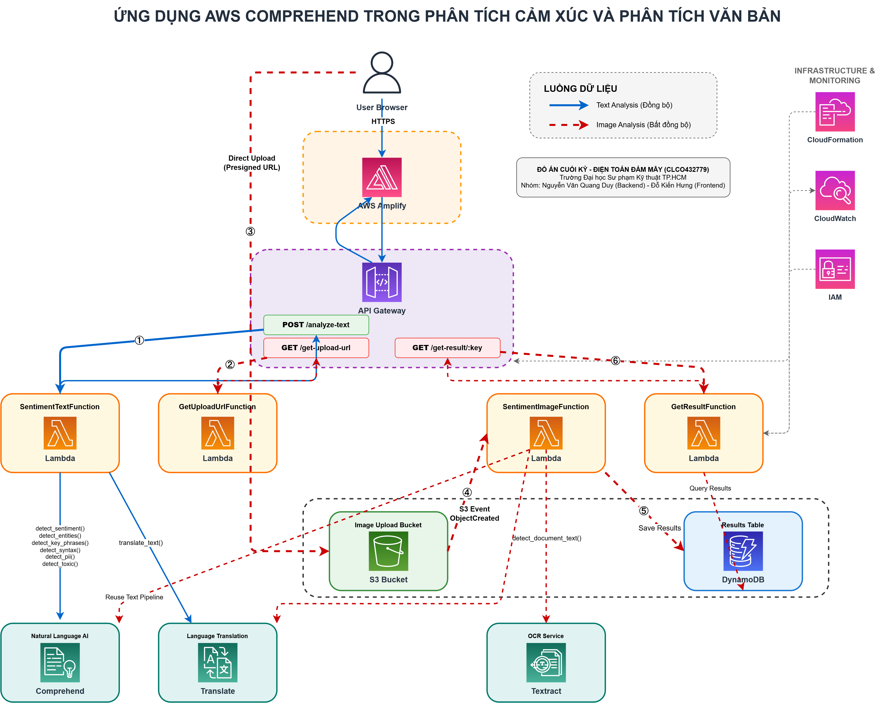
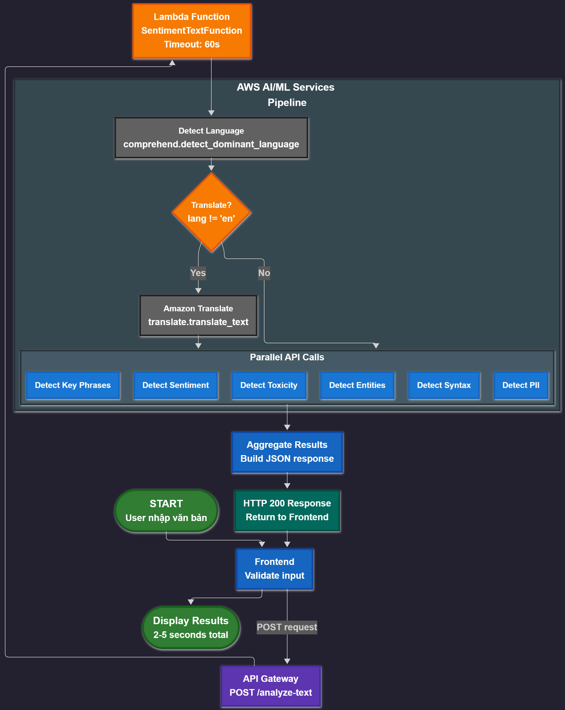
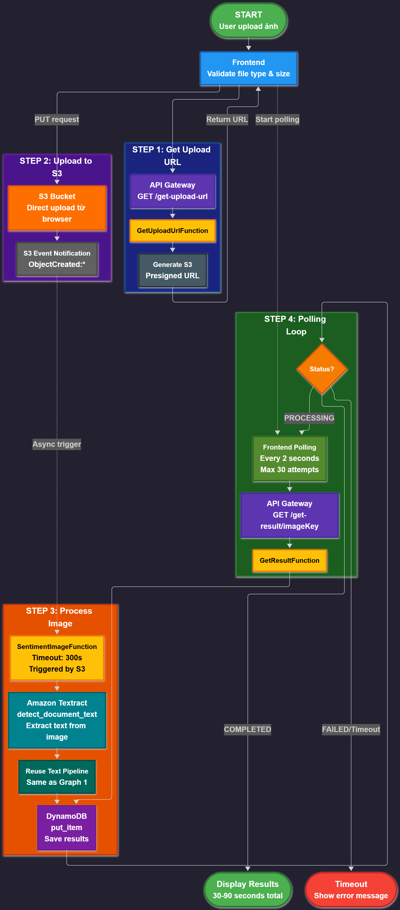

# 🎭 Sentiment Analysis Web Application

> Frontend application cho hệ thống phân tích cảm xúc đa ngôn ngữ  
> Dự án cuối kỳ môn **Điện toán Đám mây (CLCO432779)** - HCMUTE 2025

[](https://www.javascript.com/)
[](https://html.spec.whatwg.org/)
[](https://www.w3.org/Style/CSS/)
[](https://aws.amazon.com/amplify/)
[](https://developer.mozilla.org/en-US/docs/Web/JavaScript)

Ứng dụng web phân tích văn bản thông minh sử dụng kiến trúc **serverless** trên nền tảng Amazon Web Services (AWS), cung cấp khả năng phân tích cảm xúc, trích xuất thông tin từ văn bản và hình ảnh theo thời gian thực.

---

## � Mục lục
- [Thành viên nhóm](#-thành-viên-nhóm)
- [Mục tiêu dự án](#-mục-tiêu-dự-án)
- [Tính năng chính](#-các-tính-năng-chính)
- [Cấu trúc dự án](#-cấu-trúc-dự-án-v20---modular-architecture)
- [Kiến trúc hệ thống](#-kiến-trúc-hệ-thống)
- [Hướng dẫn cài đặt](#-hướng-dẫn-cài-đặt--chạy)
- [Hướng dẫn sử dụng](#-hướng-dẫn-sử-dụng)
- [Công nghệ sử dụng](#-công-nghệ-sử-dụng)
- [Chi phí & Free Tier](#-chi-phí--aws-free-tier)
- [Troubleshooting](#-troubleshooting)
- [Tài liệu tham khảo](#-tài-liệu-tham-khảo)

---

## �👥 Thành viên nhóm

| Thành viên | Vai trò | GitHub |
|------------|---------|--------|
| **Nguyễn Văn Quang Duy** | Leader & Backend | [@QuangDuyReal](https://github.com/QuangDuyReal) |
| **Đỗ Kiến Hưng** | Frontend & Deploy | [@darktheDE](https://github.com/darktheDE) |

---

## 🎯 Mục tiêu dự án

Xây dựng ứng dụng web có khả năng:
1. ✅ Nhận văn bản hoặc hình ảnh từ người dùng
2. ✅ Sử dụng AWS AI/ML để phân tích và trích xuất thông tin sâu sắc
3. ✅ Hiển thị kết quả trực quan, dễ hiểu với giao diện hiện đại
4. ✅ Chứng minh hiểu biết về kiến trúc serverless và các mô hình dịch vụ đám mây

---

## ✨ Các tính năng chính

### 🔍 Phân tích Văn bản (Text Analysis)
- **Phân tích Cảm xúc**: Xác định cảm xúc (Tích cực, Tiêu cực, Trung tính, Hỗn hợp) với độ tin cậy chi tiết
- **Trích xuất Thực thể**: Nhận diện tên người, tổ chức, địa điểm, ngày tháng, số liệu...
- **Cụm từ Khóa**: Rút trích các cụm từ quan trọng nhất
- **Phát hiện Ngôn ngữ**: Tự động phát hiện và dịch (hỗ trợ 12+ ngôn ngữ)
- **Phát hiện PII**: Nhận diện thông tin cá nhân (tên, email, số điện thoại, địa chỉ...)
- **Phân tích Cú pháp**: Phân loại từ loại (danh từ, động từ, tính từ...) với bản địa hóa tiếng Việt
- **Phát hiện Độc hại**: Phân tích mức độ độc hại, lăng mạ, quấy rối trong nội dung

### 🖼️ Phân tích Hình ảnh (Image Analysis)
- **OCR (Textract)**: Trích xuất văn bản từ ảnh tự động
- **Polling thông minh**: Cơ chế bất đồng bộ với 60 lần thử (6 phút timeout)
- **Upload trực tiếp**: Presigned S3 URL cho hiệu suất tối ưu
- Hỗ trợ định dạng: JPG, PNG, HEIC (tối đa 5MB)

### 🎨 Giao diện hiện đại
- **Theme**: Purple gradient với glassmorphism effects
- **Responsive**: Tương thích mọi thiết bị (Desktop, Tablet, Mobile)
- **Interactive**: Animations, loading states, error handling
- **Tab-based UI**: Chuyển đổi dễ dàng giữa Text/Image mode

---

## 📂 Cấu trúc Dự án (v2.0 - Modular Architecture)

```
sentiment-analysis/
├── index.html                    # Trang chính (274 dòng)
├── css/
│   └── style.css                # Stylesheet với purple theme
├── js/
│   ├── app.js                   # Entry point - khởi tạo ứng dụng
│   ├── config.js                # API endpoints (gitignored)
│   ├── dom.js                   # Centralized DOM references
│   ├── api/
│   │   ├── text-analysis.js     # Text API calls
│   │   └── image-analysis.js    # Image upload & polling logic
│   ├── ui/
│   │   ├── state.js             # UI state management + utilities
│   │   ├── tabs.js              # Tab switching logic
│   │   └── file-upload.js       # File selection & validation
│   └── display/
│       ├── index.js             # Display coordinator
│       ├── stats.js             # Stats cards display
│       ├── sentiment.js         # Sentiment breakdown
│       ├── entities.js          # Entities table
│       ├── keyphrases.js        # Key phrases tags
│       ├── language.js          # Language detection info
│       ├── pii.js               # PII detection results
│       ├── syntax.js            # Syntax analysis (Vietnamese POS)
│       └── toxicity.js          # Toxicity analysis
├── .gitignore
└── README.md                    # File này
```

### 🔄 Thay đổi so với v1.0
| Aspect | v1.0 | v2.0 |
|--------|------|------|
| **Architecture** | Monolithic (1054 dòng) | Modular (16 modules) |
| **Maintainability** | Khó debug, khó mở rộng | Dễ bảo trì, scalable |
| **Code Organization** | Single file | Separation of concerns |
| **Academic Fit** | Hard to review | Professional structure |

---

## 🏗️ Kiến trúc Hệ thống

### 📊 Tổng quan Kiến trúc AWS

*Sơ đồ tổng quan kiến trúc AWS Serverless với các luồng Text và Image Analysis*

### Frontend (Pure JavaScript - No Framework)
```
┌─────────────────────────────────────────────┐
│  Browser (index.html)                       │
│  ├── CSS (Purple Gradient Theme)            │
│  └── JavaScript ES6 Modules                 │
│      ├── app.js (Main entry)                │
│      ├── api/ (Backend communication)       │
│      ├── ui/ (State & interactions)         │
│      └── display/ (Result rendering)        │
└─────────────────────────────────────────────┘
                    │
                    ▼
┌─────────────────────────────────────────────┐
│  AWS Amplify Hosting                        │
│  - Static site hosting                      │
│  - CI/CD from GitHub                        │
│  - HTTPS enabled                            │
└─────────────────────────────────────────────┘
```

#### 🗂️ Kiến trúc Frontend theo lớp

*Kiến trúc phân lớp của Frontend với các module được tổ chức rõ ràng*

#### 🔗 Biểu đồ phụ thuộc Module

*Sơ đồ quan hệ giữa các JavaScript modules trong dự án*

### Backend (AWS Serverless)

#### 📝 Text Analysis (Đồng bộ)
```
Client → API Gateway → Lambda → Comprehend/Translate → Response
         /analyze-text   (Python)    (AI/ML Services)
```


*Luồng xử lý phân tích văn bản từ client đến AWS services*

#### 🖼️ Image Analysis (Bất đồng bộ - 3 bước)
```
1. Client → GET /get-upload-url → Lambda → Presigned S3 URL
2. Client → PUT to S3 URL → S3 Bucket → Trigger Lambda
3. Lambda → Textract (OCR) → Comprehend → Save to DynamoDB
4. Client → Poll GET /get-result/{key} → Lambda → DynamoDB → Results
   (Polling: 6s interval, max 60 attempts = 6 minutes)
```


*Luồng xử lý phân tích hình ảnh với cơ chế polling bất đồng bộ*


*Pipeline xử lý dữ liệu chi tiết cho Image Analysis*

### AWS Services Map
| Service | Vai trò |
|---------|---------|
| **API Gateway** | REST API endpoints với CORS |
| **Lambda** | Serverless compute (Python 3.x) |
| **Comprehend** | Sentiment, Entities, Key Phrases, Syntax, PII, Toxicity |
| **Translate** | Dịch tự động (vi→en, etc.) |
| **Textract** | OCR - trích xuất text từ ảnh |
| **S3** | Lưu trữ ảnh upload |
| **DynamoDB** | Lưu kết quả phân tích ảnh |
| **Amplify** | Hosting + CI/CD cho frontend |
| **IAM** | Quản lý quyền truy cập |

#### 🔄 Resource Dependency Graph

*Sơ đồ phụ thuộc giữa các AWS resources trong hệ thống*

---

## 🚀 Hướng dẫn Cài đặt & Chạy

### ⚙️ Yêu cầu hệ thống

| Component | Requirement | Purpose |
|-----------|-------------|---------|
| **Browser** | Chrome 90+, Firefox 88+, Edge 90+ | Modern ES6 support |
| **Git** | 2.x+ | Version control |
| **Python** | 3.8+ (optional) | Local dev server |
| **AWS Account** | Free Tier | Backend API access |
| **Text Editor** | VS Code (recommended) | Code editing |

### 1️⃣ Clone Repository

```bash
# Clone from GitHub
git clone https://github.com/darktheDE/sentiment-analysis.git

# Navigate to frontend directory
cd sentiment-analysis

# Check structure
ls -la
```

### 2️⃣ Cấu hình API Endpoints

**Tạo file `js/config.js`** (file này đã được gitignore):

```javascript
// js/config.js
const API_ENDPOINT_TEXT = 'https://YOUR-API-ID.execute-api.REGION.amazonaws.com/Prod/analyze-text';
const API_ENDPOINT_GET_UPLOAD_URL = 'https://YOUR-API-ID.execute-api.REGION.amazonaws.com/Prod/get-upload-url';
const API_ENDPOINT_GET_RESULT = 'https://YOUR-API-ID.execute-api.REGION.amazonaws.com/Prod/get-result';
```

**Lấy API endpoints:**
1. Deploy backend theo hướng dẫn trong `sentiment-analysis-be/`
2. Copy API Gateway URLs từ CloudFormation Outputs
3. Paste vào `config.js`

### 3️⃣ Chạy Local Development Server

**Option 1: Python HTTP Server (Đơn giản nhất)**
```bash
# Python 3.x
python -m http.server 8000

# Access: http://localhost:8000
```

**Option 2: VS Code Live Server Extension**
```
1. Install "Live Server" extension
2. Right-click index.html
3. Select "Open with Live Server"
4. Auto-reload on file changes
```

**Option 3: Node.js http-server**
```bash
# Install globally
npm install -g http-server

# Run server
http-server -p 8000 -c-1

# Access: http://localhost:8000
```

### 4️⃣ Verify Installation

**Checklist:**
- [ ] Browser opens `http://localhost:8000`
- [ ] No console errors (F12 → Console tab)
- [ ] Both tabs (Văn bản/Hình ảnh) visible
- [ ] Can switch between tabs
- [ ] `js/config.js` exists with correct endpoints
- [ ] Network tab shows no 404 errors for JS modules

### 5️⃣ Deploy lên AWS Amplify

**Step-by-step deployment:**

```bash
# 1. Push to GitHub
git add .
git commit -m "Initial commit"
git push origin main

# 2. AWS Amplify Console Setup
# - Đăng nhập AWS Console
# - Vào AWS Amplify service
# - Click "New app" → "Host web app"
# - Connect GitHub repository
# - Select branch: main
# - Build settings: Auto-detected (Static)
# - Advanced: Add environment variables (optional)
#   - API_ENDPOINT_TEXT
#   - API_ENDPOINT_GET_UPLOAD_URL
#   - API_ENDPOINT_GET_RESULT

# 3. Deploy
# Amplify tự động:
# - Clone repository
# - Build (if needed)
# - Deploy to CDN
# - Provide HTTPS URL
```

**Build Settings** (amplify.yml - auto-generated):
```yaml
version: 1
frontend:
  phases:
    build:
      commands:
        - echo "Static site - no build needed"
  artifacts:
    baseDirectory: /
    files:
      - '**/*'
  cache:
    paths: []
```

**Post-Deployment:**
- ✅ Access via Amplify URL: `https://xxx.amplifyapp.com`
- ✅ HTTPS enabled by default
- ✅ CI/CD: Auto-deploy on git push
- ✅ Custom domain (optional): Configure in Amplify settings

---

## 📖 Hướng dẫn Sử dụng

### 📝 Phân tích Văn bản

**Bước thực hiện:**
1. Chọn tab **"Văn bản"**
2. Nhập văn bản vào textarea (tối đa 5000 bytes UTF-8)
3. Click **"Phân tích"** hoặc nhấn **Ctrl + Enter**
4. Đợi 2-5 giây để xử lý

**Kết quả hiển thị:**

| Component | Mô tả | Thông tin |
|-----------|-------|-----------|
| **Stats Cards** | Tổng quan nhanh | Sentiment, số entities, key phrases |
| **Sentiment Breakdown** | Biểu đồ cảm xúc | 4 cảm xúc với % chi tiết |
| **Entities Table** | Bảng thực thể | Tên người, tổ chức, địa điểm, ngày tháng |
| **Key Phrases** | Cụm từ quan trọng | Tags có thể click |
| **Language Info** | Ngôn ngữ & dịch | Auto-detect + translation status |
| **PII Detection** | Thông tin cá nhân | Email, phone, địa chỉ được che |
| **Syntax Analysis** | Phân tích từ loại | 15 tokens đầu (tiếng Việt) |
| **Toxicity Analysis** | Độc hại content | Hate speech, profanity, harassment |

### 🖼️ Phân tích Hình ảnh

**Bước thực hiện:**
1. Chọn tab **"Hình ảnh"**
2. Click **"Chọn hình ảnh"** 
   - Định dạng: JPG, PNG, HEIC
   - Kích thước: Tối đa 5MB
3. Click **"Phân tích"**
4. Đợi polling (loading spinner)
   - Interval: 6 giây/lần
   - Max attempts: 60 (= 6 phút)
5. Kết quả hiển thị tương tự Text Analysis

**Lưu ý**: 
- OCR text được hiển thị trước khi phân tích
- Hình ảnh phức tạp có thể mất 1-3 phút
- Nếu timeout sau 6 phút, thử lại với ảnh đơn giản hơn

### 💡 Ví dụ Test Cases

**Test Case 1: English Positive Sentiment**
```
Amazon Web Services is a great cloud platform. Jeff Bezos is the founder 
of Amazon, which is headquartered in Seattle.
```
**Expected Results:**
- Sentiment: POSITIVE (85-95%)
- Entities: Amazon Web Services (ORGANIZATION), Jeff Bezos (PERSON), 
  Amazon (ORGANIZATION), Seattle (LOCATION)
- Key Phrases: "great cloud platform", "Amazon Web Services"

**Test Case 2: Vietnamese Auto-Translation**
```
Tôi rất thích dịch vụ này. AWS Comprehend thật tuyệt vời!
```
**Expected Results:**
- Detected Language: vi (Vietnamese)
- Translation Info: Đã dịch sang tiếng Anh
- Sentiment: POSITIVE (90%+)

**Test Case 3: PII Detection**
```
Contact John Doe at john.doe@email.com or call +1-234-567-8900. 
He lives at 123 Main St, New York.
```
**Expected Results:**
- PII Entities: john.doe@email.com (EMAIL), +1-234-567-8900 (PHONE), 
  123 Main St, New York (ADDRESS)
- Redacted Text: Contact John Doe at [EMAIL] or call [PHONE]. He lives at [ADDRESS].

---

## 🛠️ Công nghệ Sử dụng

### Frontend Stack

| Category | Technology | Version | Purpose |
|----------|-----------|---------|---------|
| **Markup** | HTML5 | - | Semantic structure |
| **Styling** | CSS3 | - | Purple gradient theme, glassmorphism |
| **Scripting** | JavaScript | ES6+ (ES2015+) | Modular architecture |
| **Modules** | ES6 Modules | Native | Import/Export system |
| **HTTP Client** | Fetch API | Native | Async API calls |
| **Icons** | Unicode/Emoji | - | No external icon library |

### Architecture Patterns

| Pattern | Implementation | Benefit |
|---------|----------------|---------|
| **Separation of Concerns** | 16 modules (api/, ui/, display/) | Maintainability |
| **Module Pattern** | ES6 import/export | Encapsulation |
| **Observer Pattern** | Event listeners, polling | Reactive UI |
| **Factory Pattern** | Display components creation | Scalability |
| **State Management** | `ui/state.js` centralized | Single source of truth |

### Backend Integration

| AWS Service | Purpose | Used In |
|------------|---------|---------|
| **API Gateway** | REST API endpoints | All API calls |
| **Lambda** | Serverless compute | Text/Image processing |
| **Comprehend** | NLP AI service | Sentiment, entities, syntax |
| **Translate** | Translation service | Multi-language support |
| **Textract** | OCR service | Image text extraction |
| **S3** | Object storage | Image upload |
| **DynamoDB** | NoSQL database | Image results storage |
| **Amplify** | Hosting + CI/CD | Static site deployment |

### Development Tools

| Tool | Purpose | Configuration |
|------|---------|---------------|
| **Git** | Version control | `.gitignore` for config |
| **VS Code** | Code editor | Extensions: Live Server, ESLint |
| **Chrome DevTools** | Debugging | Network, Console, Elements tabs |
| **AWS Console** | Cloud management | API Gateway, Amplify |

### No Dependencies! 🎉

**Zero npm packages required:**
- ❌ No React, Vue, Angular
- ❌ No jQuery, Lodash
- ❌ No Axios, Request libraries
- ❌ No CSS frameworks (Bootstrap, Tailwind)
- ✅ Pure vanilla JavaScript ES6+
- ✅ Native Fetch API
- ✅ Custom CSS from scratch

**Benefits:**
- 📦 **Lightweight**: ~50KB total (HTML+CSS+JS)
- ⚡ **Fast load**: No framework overhead
- 🔒 **Secure**: No dependency vulnerabilities
- 📚 **Educational**: Learn fundamentals, not abstractions

---

## 📊 Chi phí & AWS Free Tier

### Cost Breakdown

| Service | Free Tier Limit | Estimated Usage | Cost After Free Tier | Monthly Cost |
|---------|-----------------|-----------------|---------------------|--------------|
| **Comprehend** | 50K units/month (3 months) | ~1000 requests | $0.0001/unit | ~$0.10 |
| **Translate** | 2M chars/month (12 months) | ~100K chars | $15/1M chars | ~$1.50 |
| **Textract** | 1K pages/month (3 months) | ~50 images | $1.50/1000 pages | ~$0.08 |
| **Lambda** | 1M requests/month | ~500 requests | $0.20/1M requests | ~$0.00 |
| **API Gateway** | 1M requests/month | ~500 requests | $3.50/1M requests | ~$0.00 |
| **S3** | 5GB storage, 20K GET, 2K PUT | <100MB, 100 requests | $0.023/GB/month | ~$0.00 |
| **DynamoDB** | 25GB storage, 25 RCU/WCU | <1GB, <100 requests | On-demand pricing | ~$0.00 |
| **Amplify** | 1000 build min/month, 5GB storage | ~50 min, <1GB | $0.01/min, $0.15/GB | ~$0.00 |
| **Data Transfer** | 1GB/month (out) | <100MB | $0.09/GB | ~$0.00 |
| **Total** | - | - | - | **~$0.00-$2.00** |

### 💡 Cost Optimization Tips

1. **Stay within Free Tier**:
   - Monitor usage in AWS Cost Explorer
   - Set billing alarms at $1, $5, $10
   - Use AWS Budgets for alerts

2. **Optimize requests**:
   - Cache results in browser localStorage
   - Debounce text input (wait 500ms after typing)
   - Batch multiple analyses

3. **Image processing**:
   - Compress images before upload
   - Use lower resolution for testing
   - Delete S3 objects after 7 days (lifecycle policy)

4. **Development**:
   - Use local mock APIs for testing
   - Don't commit `config.js` with real endpoints
   - Use separate dev/prod environments

### 🎯 Estimated Monthly Cost by Usage

| Usage Level | Requests/month | Images/month | Estimated Cost |
|-------------|----------------|--------------|----------------|
| **Light** (Testing) | <100 | <10 | $0.00 (Free Tier) |
| **Moderate** (Demo) | ~500 | ~50 | $0.00-$0.50 |
| **Heavy** (Production) | 5000+ | 500+ | $5-$20 |

**⚠️ Important**: Dự án được thiết kế để nằm hoàn toàn trong Free Tier khi sử dụng mức độ vừa phải (~$0/month).

---

## 🐛 Troubleshooting

### Common Issues

| Issue | Cause | Solution |
|-------|-------|----------|
| **Module loading error** | Missing `type="module"` | Ensure `<script type="module">` in HTML |
| **File protocol error** | Opening HTML directly | Use local server (http://) |
| **CORS error** | API Gateway CORS not configured | Check backend CORS settings |
| **404 on polling** | Image still processing | Wait for more polling attempts (normal behavior) |
| **Blank results** | API response format mismatch | Check Network tab in DevTools (F12) |
| **Upload fails** | File size > 5MB | Use smaller image |
| **Long processing** | Complex image OCR | Wait up to 6 minutes max |

### Debug Steps

1. **Open Browser DevTools** (F12)
2. **Network Tab**: Check API requests/responses
3. **Console Tab**: Look for JavaScript errors
4. **Check API Response**: Verify JSON structure matches expected format
5. **Backend Logs**: Review CloudWatch logs if backend issues suspected

### Quick Fixes

```bash
# 1. Restart local server
# Ctrl+C to stop, then:
python -m http.server 8000

# 2. Clear browser cache
# Chrome: Ctrl+Shift+Delete → Clear cached images and files

# 3. Verify config.js exists
ls js/config.js

# 4. Test API endpoint manually
curl -X POST https://YOUR-API/analyze-text \
  -H "Content-Type: application/json" \
  -d '{"text": "test"}'
```

---

## 📚 Tài liệu Tham khảo

### Frontend Technologies
- [JavaScript ES6 Modules](https://developer.mozilla.org/en-US/docs/Web/JavaScript/Guide/Modules)
- [HTML5 Specification](https://html.spec.whatwg.org/)
- [CSS3 Reference](https://developer.mozilla.org/en-US/docs/Web/CSS)
- [Fetch API](https://developer.mozilla.org/en-US/docs/Web/API/Fetch_API)

### AWS Services
- [AWS Comprehend](https://docs.aws.amazon.com/comprehend/) - Natural Language Processing
- [AWS Lambda](https://docs.aws.amazon.com/lambda/latest/dg/lambda-python.html) - Serverless compute
- [Amazon Translate](https://docs.aws.amazon.com/translate/) - Machine translation
- [Amazon Textract](https://docs.aws.amazon.com/textract/) - OCR service
- [AWS Amplify Hosting](https://docs.aws.amazon.com/amplify/) - Static site hosting

### Design & UI/UX
- [Glassmorphism Design](https://css.glass/) - Modern UI effects
- [CSS Gradient Generator](https://cssgradient.io/) - Gradient backgrounds
- [Material Icons](https://fonts.google.com/icons) - Icon library

---

## 🔗 Related Repositories

- **Backend API**: [sentiment-analysis-be](../sentiment-analysis-be/) - AWS Lambda functions & SAM template
- **Documentation**: [docs/](./docs/) - Architecture diagrams & technical specs

---

## 📞 Support & Contributing

### Reporting Issues
Nếu gặp vấn đề:
1. Check [Troubleshooting](#-troubleshooting) section
2. Review browser console for errors
3. Create GitHub issue với:
   - Error message & screenshot
   - Browser & version
   - Steps to reproduce

### Contributing
Contributions welcome! Please:
1. Fork repository
2. Create feature branch (`git checkout -b feature/NewFeature`)
3. Follow existing code style & module structure
4. Test thoroughly locally
5. Submit Pull Request with clear description

---

## 🎓 Bối cảnh Học thuật

**Môn học**: Điện toán Đám mây (CLCO432779)  
**Học kỳ**: 1 (2025-2026)  
**Trường**: Đại học Sư phạm Kỹ thuật TP.HCM (HCMUTE)  
**Giảng viên**: [Tên giảng viên]

### Kiến thức được áp dụng
- ✅ **Cloud Service Models**: IaaS, PaaS, SaaS
- ✅ **Serverless Architecture**: Event-driven, auto-scaling
- ✅ **Cloud Design Patterns**: Async processing, polling, presigned URLs
- ✅ **Frontend Architecture**: Modular design, separation of concerns
- ✅ **AWS Services Integration**: Comprehend, Translate, Textract, S3, DynamoDB
- ✅ **DevOps**: CI/CD with AWS Amplify, Git workflow

### Learning Outcomes
1. 📚 Hiểu và triển khai kiến trúc serverless trên AWS
2. 🛠️ Tích hợp AI/ML services vào web application
3. 🎨 Xây dựng modern UI/UX với vanilla JavaScript
4. 🔄 Implement async workflows (polling, event-driven)
5. 📊 Monitor & debug cloud applications

---

## 📄 License

Dự án này được phát triển cho mục đích học tập. Code được public để chia sẻ kiến thức với cộng đồng.

**MIT License** - Free to use for educational purposes.

---

**Last Updated**: October 22, 2025  
**Frontend Version**: 2.0.0  
**Maintained by**: [@darktheDE](https://github.com/darktheDE) & [@QuangDuyReal](https://github.com/QuangDuyReal)

© 2025 Sentiment Analysis Frontend - HCMUTE - CLCO432779

